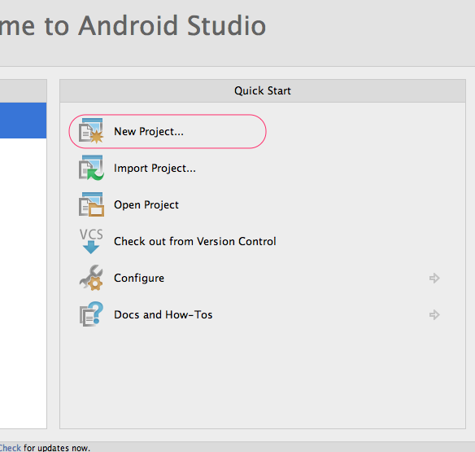
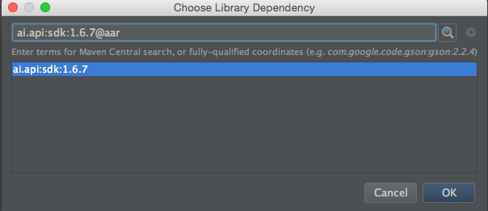
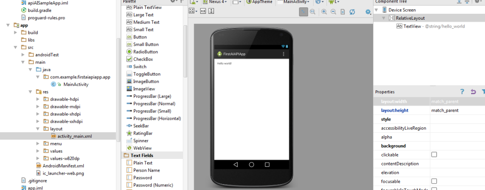
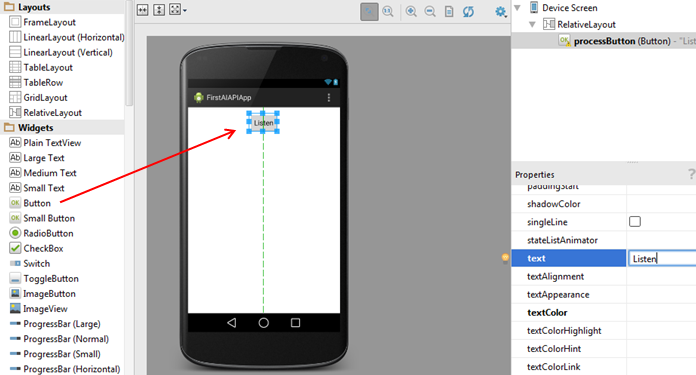
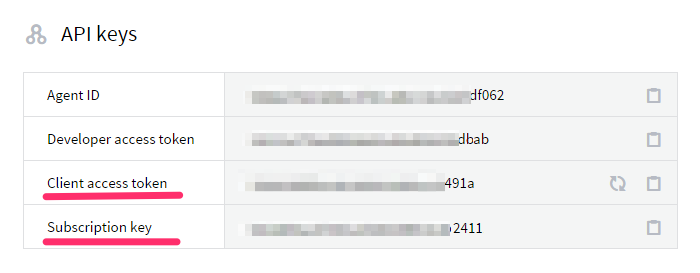
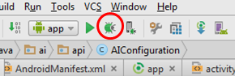

Android SDK for api.ai
==================

[](https://travis-ci.org/api-ai/api-ai-android-sdk) [](https://maven-badges.herokuapp.com/maven-central/ai.api/sdk)

The API.AI Android SDK makes it easy to integrate speech recognition with [API.AI](http://www.api.ai) natural language processing API on Android devices. API.AI allows using voice commands and integration with dialog scenarios defined for a particular agent in API.AI.

Two permissions are required to use the API.AI Android SDK:

* **android.permission.INTERNET** for internet access
* **android.permission.RECORD_AUDIO** for microphone access

Add this dependencies to your project to use SDK

```
compile 'ai.api:libai:1.4.8'
compile 'ai.api:sdk:2.0.5@aar'
// api.ai SDK dependencies
compile 'com.android.support:appcompat-v7:23.2.1'
compile 'com.google.code.gson:gson:2.3.1'
compile 'commons-io:commons-io:2.4'
```

Currently, speech recognition is performed using Google's Android SDK, either on the client device or in the cloud. Recognized text is passed to the API.AI through HTTP requests. Also you can try Speaktoit recognition engine (Use [AIConfiguration.RecognitionEngine.Speaktoit](https://github.com/api-ai/api-ai-android-sdk/blob/master/ailib/src/main/java/ai/api/AIConfiguration.java#L37)).

Authentication is accomplished through setting the client access token when initializing an [AIConfiguration](https://github.com/api-ai/api-ai-android-sdk/blob/master/ailib/src/main/java/ai/api/android/AIConfiguration.java) object. The client access token specifies which agent will be used for natural language processing.

**Note:** The API.AI Android SDK only makes query requests, and cannot be used to manage entities and intents. Instead, use the API.AI user interface or REST API to  create, retrieve, update, and delete entities and intents.

* [Running the Sample Code](#running_sample)
* [Getting Started with Your Own App](#getting_started)
* [Tutorial](#tutorial)
* [Brief Integration Instruction (for experienced developers)](docs/integration.md)
* [Feature examples](#feature-examples)
    * [User specified contexts](#user-specified-contexts)
    * [User specified entities](#user-specified-entities)
    * [Bluetooth support](#bluetooth-support)
* [Troubleshooting](#troubleshooting)

# <a name="running_sample" />Running the Sample Code

The API.AI Android SDK comes with a simple sample that illustrates how voice commands can be integrated with API.AI. Use the following steps to run the sample code:

1. Have an API.AI agent created that has entities and intents. See the [API.AI documentation](http://api.ai/docs/getting-started/5-min-guide/) on how to do this.
2. Open [Android Studio](https://developer.android.com/sdk/installing/studio.html).
3. Import the **api-ai-android-master** directory.
4. Open the SDK Manager and be sure that you have installed Android Build Tools 19.1.
5. In the Project browser, open **apiAISampleApp/src/main/java/ai.api.sample/Config**.
6. Towards the top of the file, you will see a declaration of a static final string called *ACCESS_TOKEN*. Set its value to be the client access token of your agent.
7. Attach an Android device, or have the emulator set up with an emulated device.
8. From the **Run** menu, choose **Debug** (or click the Debug symbol). Choose your device.
9. You should see an app running with three buttons: **Listen**, **StopListen**, and **Cancel**.
10. Click **Listen** and say a phrase that will be understood by your agent. Wait a few seconds. The Java will appear that is returned by the API.AI service.

# <a name="getting_started" />Getting Started with Your Own App

This section describes what you need to do to get started with your own app that uses the API.AI Android SDK. The first part provides an overview of how to use the SDK, and the second part is a tutorial with detailed step-by-step instructions for creating your own app.

If you are an experienced developer you might use [brief integration instruction](docs/integration.md).

## Overview

To implement speech recognition and natural language processing features in your app, you must first add the API.AI SDK library to your project. There are two ways to accomplish this. The first way is recommended:

1. Add a dependency to your *build.gradle* file. Add the following line to your **build.gradle** file. (In the sample app, the **apiAISampleApp/build.gradle** is an example of how to do this.)

    ```
    compile 'ai.api:libai:1.4.8'
    compile 'ai.api:sdk:2.0.5@aar'
    // api.ai SDK dependencies
    compile 'com.android.support:appcompat-v7:23.2.1'
    compile 'com.google.code.gson:gson:2.3'
    compile 'commons-io:commons-io:2.4'
    ```
    
2. (Not recommended) Download the library source code from github, and attach it to your project.

Now you can use API.AI service features in your app using either integrated speech recognition or using your own speech recognition.

## Using integrated speech recognition

Once you've added the SDK library, follow these steps:

1. Add two permissions into the AndroidManifest:
    * **android.permission.INTERNET**
    * **android.permission.RECORD_AUDIO**
    
2. Create a class that implements the AIListener interface. This class will process responses from API.AI.

    ```java
    public interface AIListener {
        void onResult(AIResponse result); // here process response
        void onError(AIError error); // here process error
        void onAudioLevel(float level); // callback for sound level visualization
        void onListeningStarted(); // indicate start listening here
        void onListeningCanceled(); // indicate stop listening here
        void onListeningFinished(); // indicate stop listening here
    }
    ```

3. Create an instance of AIConfiguration, specifying the access token, locale, and recognition engine.

    ```java
    final AIConfiguration config = new AIConfiguration("CLIENT_ACCESS_TOKEN",
                AIConfiguration.SupportedLanguages.English,
                AIConfiguration.RecognitionEngine.System);
    ```

4. Use the AIConfiguration object to get a reference to the AIService, which will make the query requests.

    ```java
    AIService aiService = AIService.getService(context, config);
    ```

5. Set the AIListener instance for the AIService instance.

    ```java
    aiService.setListener(yourAiListenerInstance);
    ```

6. Launch listening from the microphone via the **startListening** method. The SDK will start listening for the microphone input of the mobile device.

    ```java
    aiService.startListening();
    ```

7. To stop listening and start the request to the API.AI service using the current recognition results, call the **stopListening** method of the AIService class.

    ```java
    aiService.stopListening();
    ```

8. To cancel the listening process without sending a request to the API.AI service, call the **cancel** method of the AIService class.

    ```java
    aiService.cancel();
    ```

9. If there are no errors, you can get the result using the **AIResponse.getResult** method. From there, you can obtain the action and parameters.

    ```java
    public void onResult(final AIResponse response) {
        Log.i(TAG, "Action: " + result.getAction());
        // process response object
    }
    ```

## Using your own speech recognition

This section assumes that you have performed your own speech recognition and that you have text that you want to process as natural language. Once you've added the SDK library, follow these steps:

1. Add this permission into the AndroidManifest:
    * **android.permission.INTERNET**
    
2. Create an instance of **AIConfiguration**, specifying the access token, locale, and recognition engine. You can specify any recognition engine, since that value will not be used.
3. Create an **AIDataService** instance using the configuration object.
4. Create the empty **AIRequest** instance. Set the request text using the method **setQuery**.
5. Send the request to the API.AI service using the method **aiDataService.request(aiRequest)**.
6. Process the response.

The following example code sends a query with the text "Hello".
First, it initialize `aiDataService` and `aiRequest` instances
```java
final AIConfiguration config = new AIConfiguration(ACCESS_TOKEN, 
    AIConfiguration.SupportedLanguages.English, 
    AIConfiguration.RecognitionEngine.System);

final AIDataService aiDataService = new AIDataService(config);

final AIRequest aiRequest = new AIRequest();
aiRequest.setQuery("Hello");
```

Then it calls the `aiDataService.request` method. Please note, that you must call `aiDataService.request` method from background thread, using `AsyncTask` class, for example.
```java
new AsyncTask<AIRequest, Void, AIResponse>() {
    @Override
    protected AIResponse doInBackground(AIRequest... requests) {
        final AIRequest request = requests[0];
        try {
            final AIResponse response = aiDataService.request(aiRequest);
            return response;
        } catch (AIServiceException e) {
        }
        return null;
    }
    @Override
    protected void onPostExecute(AIResponse aiResponse) {
        if (aiResponse != null) {
            // process aiResponse here
        }
    }
}.execute(aiRequest);
```

## Getting results
After implementing AIListener interface, you can get the response from api.ai inside your listener like this:

```java
public void onResult(final AIResponse response) {
   // Use the response object to get all the results
}
```

Here is how to get different part of the result object:

* Get the status

   ```java
   final Status status = response.getStatus();
   Log.i(TAG, "Status code: " + status.getCode());
   Log.i(TAG, "Status type: " + status.getErrorType());
   ```
   
* Get resolved query

   ```java
   final Result result = response.getResult();
   Log.i(TAG, "Resolved query: " + result.getResolvedQuery());
   ```
   
* Get action

   ```java
   final Result result = response.getResult();
   Log.i(TAG, "Action: " + result.getAction());
   ```
   
* Get speech

   ```java
   final Result result = response.getResult();
   final String speech = result.getFulfillment().getSpeech();
   Log.i(TAG, "Speech: " + speech);
   ```
   
* Get metadata

   ```java
   final Result result = response.getResult();
   final Metadata metadata = result.getMetadata();
   if (metadata != null) {
     Log.i(TAG, "Intent id: " + metadata.getIntentId());
     Log.i(TAG, "Intent name: " + metadata.getIntentName());
   }
   ```

* Get parameters

   ```java
   final Result result = response.getResult();
   final HashMap<String, JsonElement> params = result.getParameters();
   if (params != null && !params.isEmpty()) {
     Log.i(TAG, "Parameters: ");
     for (final Map.Entry<String, JsonElement> entry : params.entrySet()) {
         Log.i(TAG, String.format("%s: %s", entry.getKey(), entry.getValue().toString()));
     }
   }
   ```
    
# <a name="tutorial" />Tutorial

This section contains a detailed tutorial about creating new app and connect it to API.AI.

## Create a new app

Follow these steps to set up your environment and create new android app with API.AI integration:

1. Create an API.AI agent with entities and intents, or use one that you've already created. See the API.AI documentation for instructions on how to do this. 
2. Open [Android Studio](https://developer.android.com/sdk/installing/studio.html). (Download it if you don't have it.)
3. From the start screen (or **File** menu) , choose **New Project...**.<br/> 
4. In the New Project dialog, fill **Application name** and **Company Domain**, then click **Next**.<br/> 
5. Choose minimum SDK for project, minimum supported by API.AI SDK is **9 Gingerbread**. Click **Next**.<br/> 
6. Select **Blank Activity** and click **Next**.
7. Enter the main activity name and click **Finish**.

## Integrate with the SDK

Next you will integrate with the SDK to be able to make calls. Follow these steps:

1. Open **AndroidManifest.xml** under **app/src/main**. 
2. Just above the `<application>` tag, add these line in order to give the app permission to access the internet and the microphone:

    ```xml
    <uses-permission android:name="android.permission.INTERNET"/>
    <uses-permission android:name="android.permission.RECORD_AUDIO" />
    ```
    
3. Save **AndroidManifest.xml**.
4. Next, you need to add a new dependency for the AI.API library. Right click on your module name (it should be _app_) in the Project Navigator and select **Open Module Settings**. Click on the **Dependencies** tab. Click on the **+** sign on the bottom left side and select **Library dependency**. <br/>
5. In the opened dialog search **ai.api**, choose **ai.api:sdk:2.0.5** item and append `@aar` to the end of library name (see image) then click OK.<br/> 
    * Also you need to add dependencies of the SDK library : *com.android.support:appcompat-v7*, *com.google.code.gson:gson*, *commons-io:commons-io*. Add them in the same way.
6. Open **MainActivity.java** under **app/src/main/java/com.example.yourAppName.app**, or whatever your package name is.
7. Expand the import section and add the following lines to import the necessary API.AI classes:
    
    ```java
    import ai.api.AIListener;
    import ai.api.android.AIConfiguration;
    import ai.api.android.AIService;
    import ai.api.model.AIError;
    import ai.api.model.AIResponse;
    import ai.api.model.Result;
    import com.google.gson.JsonElement;
    import java.util.Map;
    ```
    
## Create the user interface
1. Open **activity_main.xml** under **app/src/main/res/layout**. This will open the layout in the designer.<br/>
2. Select and delete the "Hello World" TextView.
3. Drag a Button (under Widgets) to the top of the screen. Change the **id** property to "listenButton" and the **text** property to "Listen".<br/>
4. Drag a Plain TextView (under Widgets) under the button. Expand it so that it covers the rest of the bottom of the screen. Change the **id** property to "resultTextView" and the **text** property to an empty string.<br/>
6. Now return to the MainActivity.java file. Add three import statements to access our widgets:
    
    ```java
    import android.view.View;
    import android.widget.Button;
    import android.widget.TextView;
    ```
    
7. Create two private members in MainActivity for the widgets:
   
    ```java
    private Button listenButton;
    private TextView resultTextView;
    ```
    
8. At the end of the OnCreate method, add these lines to initialize the widgets:
    
    ```java
    listenButton = (Button) findViewById(R.id.listenButton);
    resultTextView = (TextView) findViewById(R.id.resultTextView);
    ```
    
## Create the AI Service and Listener

1. Use the MainActivity as the class that will be called when events occur by having it implement the AIListener class. Replace the class declaration with this:
    
    ```
    public class MainActivity extends ActionBarActivity implements AIListener {
    ```
    
2. In the MainActivity class, create a private member for the **AIService** class named `aiService`.
    
    ```java
    private AIService aiService;
    ```
    
3. In the OnCreate method, add the following line to set up the configuration to use system speech recognition. Replace CLIENT_ACCESS_TOKEN with your client access token. 
    
    ```java
     final AIConfiguration config = new AIConfiguration("CLIENT_ACCESS_TOKEN",
            AIConfiguration.SupportedLanguages.English,
            AIConfiguration.RecognitionEngine.System);
    ```
    
    
    
4. Below this line, initialize the AI service and add this instance as the listener to handle events.
    
    ```java
    aiService = AIService.getService(this, config);
    aiService.setListener(this);
    ```
    
5. Add method to start listening on the button click:
    ```java
    public void listenButtonOnClick(final View view) {
        aiService.startListening();
    }
    ```
    
6. Return to activity_main.xml and click on the Listen button. In the properties pane, set the onClick property to listenButtonOnClick.
7. Add the following method to show the results when the listening is complete:
    
    ```java
    public void onResult(final AIResponse response) {
        Result result = response.getResult();

        // Get parameters
        String parameterString = "";
        if (result.getParameters() != null && !result.getParameters().isEmpty()) {
            for (final Map.Entry<String, JsonElement> entry : result.getParameters().entrySet()) {
                parameterString += "(" + entry.getKey() + ", " + entry.getValue() + ") ";
            }
        }

        // Show results in TextView.
        resultTextView.setText("Query:" + result.getResolvedQuery() +
            "\nAction: " + result.getAction() +
            "\nParameters: " + parameterString);
    }
    ```
    
8. Add the following method to handle errors:
    
    ```java
    @Override
    public void onError(final AIError error) {
        resultTextView.setText(error.toString());
    }
    ```
    
9. Add the following empty methods to implement the AIListener interface:
    ```java
    @Override
    public void onListeningStarted() {}

    @Override
    public void onListeningCanceled() {}

    @Override
    public void onListeningFinished() {}
    
    @Override
    public void onAudioLevel(final float level) {}
    ```
    
## Run the App
1. Attach an Android device to your computer or have a virtual device ready.
2. Make sure that your module is selected in the dropdown, and then click the Debug button.<br/>
3. The app should now be running on your device or virtual device. Click the **Listen** button and then speak a phrase that will work with your intent. Wait a few seconds. The result should appear in the result TextView. <br/>

# Feature examples

## User specified contexts

To specify additional [contexts](http://api.ai/docs/getting-started/key-concepts.html#contexts) in the query you can use `RequestExtras` object.

First create list of contexts you need:

```java
List<AIContext> contexts = new ArrayList<>();
contexts.add(new AIContext("firstContext"));
contexts.add(new AIContext("secondContext"));
```

Then create `RequestExtras` instance and use it for request

```java
RequestExtras requestExtras = new RequestExtras(contexts, null);
aiService.startListening(requestExtras);
```

## User specified entities

To specify user entities in the query you can use `RequestExtras` object.

First create list of entities you need:

```java
final Entity myDwarfs = new Entity("dwarfs");
myDwarfs.addEntry(new EntityEntry("Ori", new String[] {"Ori", "Nori"}));
myDwarfs.addEntry(new EntityEntry("Bifur", new String[] {"Bofur","Bombur"}));
final List<Entity> entities = Collections.singletonList(myDwarfs);
```

Then create `RequestExtras` instance and use it for request

```java
RequestExtras requestExtras = new RequestExtras(null, entities);
aiService.startListening(requestExtras);
```

Also you can upload user entities with separate method

```java
aiService.uploadUserEntities(entities);
```

## Bluetooth support

Do these steps to make SDK work with Bluetooth devices:

1. Create implementation of the [BluetoothController](https://github.com/api-ai/api-ai-android-sdk/blob/master/ailib/src/main/java/ai/api/util/BluetoothController.java) near your Application class
    ```java
    private class BluetoothControllerImpl extends BluetoothController {

        public BluetoothControllerImpl(Context context) {
            super(context);
        }

        @Override
        public void onHeadsetDisconnected() {
            Log.d(TAG, "Bluetooth headset disconnected");
        }

        @Override
        public void onHeadsetConnected() {
            Log.d(TAG, "Bluetooth headset connected");

            if (isInForeground() && !bluetoothController.isOnHeadsetSco()) {
                bluetoothController.start();
            }
        }

        @Override
        public void onScoAudioDisconnected() {
            Log.d(TAG, "Bluetooth sco audio finished");
            bluetoothController.stop();

            if (isInForeground()) {
                bluetoothController.start();
            }
        }

        @Override
        public void onScoAudioConnected() {
            Log.d(TAG, "Bluetooth sco audio started");
        }

    }
    ```
2. Add to your `Application` class integer field to count Activities and `BluetoothController` class implementation for Bluetooth management
    ```java
    private int activitiesCount;
    private BluetoothControllerImpl bluetoothController;
    ```

3. Add helper methods to your `Application` class
    ```java
    protected void onActivityResume() {
        if (activitiesCount++ == 0) { // on become foreground
            bluetoothController.start();
        }
    }

    protected void onActivityPaused() {
        if (--activitiesCount == 0) { // on become background
            bluetoothController.stop();
        }
    }

    private boolean isInForeground() {
        return activitiesCount > 0;
    }
    ```

4. You need to call this methods from `onPause` and `onResume` of every Activity, it can be solved with base class for all your activities
    ```java
    public class BaseActivity extends ActionBarActivity {

        private AIApplication app;

        private static final long PAUSE_CALLBACK_DELAY = 500;

        private final Handler handler = new Handler();
        private Runnable pauseCallback = new Runnable() {
            @Override
            public void run() {
                app.onActivityPaused();
            }
        };

        @Override
        protected void onCreate(Bundle savedInstanceState) {
            super.onCreate(savedInstanceState);
            app = (AIApplication) getApplication();
        }

        @Override
        protected void onResume() {
            super.onResume();
            app.onActivityResume();
        }

        @Override
        protected void onPause() {
            super.onPause();
            handler.postDelayed(pauseCallback, PAUSE_CALLBACK_DELAY);
        }
    }
    ```

A complete example can be found in the [Sample Application](https://github.com/api-ai/api-ai-android-sdk/tree/master/apiAISampleApp/src/main/java/ai/api/sample).

# <a name="troubleshooting" />Troubleshooting

* If you get an error when trying to install app that says "INSTALL_FAILED_OLDER_SDK", then check you have Android SDK 19 and build tools 19.1 installed.
